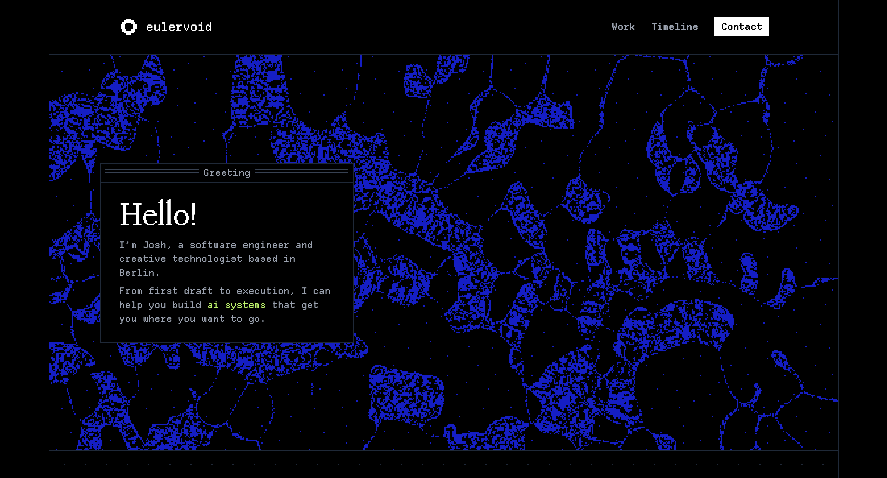

# eulervoid.com

Personal website featuring some work samples.
Check it out at [eulervoid.com](https://eulervoid.com).

## Development

Requires [Node.js](https://nodejs.org/) 22 or later.

```sh
npm install
npm run dev
```

Run all checks with `npm run check` and create a production build with `npm run build`.

## Licensing

- **Code** — [MIT](LICENSE)
- **Content (prose, images, sprites)** — [CC BY-SA 4.0](https://creativecommons.org/licenses/by-sa/4.0/)

### Fonts

- [Departure Mono](https://www.departuremono.com/) — [OFL](https://scripts.sil.org/cms/scripts/page.php?site_id=nrsi&id=OFL)
- [Mondwest](https://pangrampangram.com/products/bitmap-mondwest) — proprietary; not included in this repository. You must purchase a license to use it.
